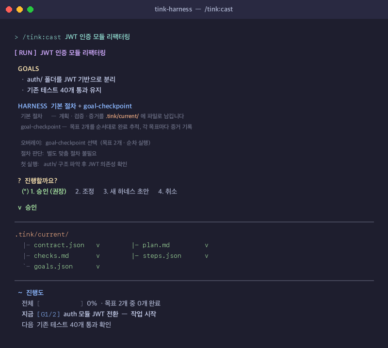

<p align="center">
  
</p>

# Tink

**Claude Code · Codex 에이전트 작업을 눈에 보이게, 재사용 가능하게, 승인 게이트로. 서버도, 숨은 상태도 없이.**

<sub>Claude Code와 Codex를 위한 작은 하네스 레이어</sub>

<p>
  <a href="https://github.com/dotoricode/tink-harness/releases/latest"></a>
  <a href="https://www.npmjs.com/package/tink-harness"></a>
  <a href="https://github.com/dotoricode/tink-harness/actions/workflows/ci.yml"></a>
  <a href="https://github.com/dotoricode/tink-harness/blob/main/LICENSE"></a>
  <a href="https://github.com/dotoricode/tink-harness/stargazers"></a>
</p>

[English](README.md) · **한국어** · [변경 이력](CHANGELOG.md)

---

*새 AI 코딩 도구를 계속 붙여 썼습니다. 하나씩은 다 쓸 만한데, 쌓을수록 환경이 무겁고 엉켰고 — 정작 일을 시작하기도 전에 토큰을 설정 다시 맞추는 데 적잖이 썼습니다. 저는 반대를 원했어요. 내가 도구에 맞추는 게 아니라, 도구가 나에게 맞춰지는 가벼운 것. 그게 Tink입니다.*

---

Tink가 없으면 에이전트 작업의 맥락은 매번 채팅 기록 속으로 사라집니다. 같은 리뷰·리팩터링·디버깅을 손으로 반복하고, 재사용하겠다고 적어둔 워크플로는 어딘가에 묻혀버립니다.

Tink를 쓰면 사소하지 않은 모든 작업마다 읽고, diff하고, 커밋할 수 있는 파일이 남습니다 — 작업 계약, 눈에 보이는 계획, 검증 단계. 재사용 워크플로(하네스)는 명시적 승인 후에만 저장되고, 실제 run 기록을 바탕으로 점점 나아집니다. 그 기록이 로컬 건강 대시보드가 됩니다.

## 1분이면 시작됩니다

**Claude Code (플러그인):**

```text
/plugin marketplace add dotoricode/tink-harness
/plugin install tink@tink-harness
/reload-plugins
/tink:setup
```

**Claude Code 또는 Codex (스탠드얼론):**

```bash
npx tink-harness@latest install
```

설치 중 `Claude Code`, `Codex`, 또는 둘 다를 선택할 수 있고, 언어는 `LANG`을 자동 감지합니다(`--lang=en|ko|zh`로 변경 가능).

<details>
<summary>repo 내부 Codex smoke 검증 (CODEX_HOME)</summary>

```bash
set CODEX_HOME=%CD%\.codex
npx tink-harness@latest install
```

</details>

문서를 더 읽는 대신 실제 작업을 맡겨 보세요:

```text
/tink:cast 인증 모듈 리팩터링     # Claude Code
$tink:cast 인증 모듈 리팩터링     # Codex
```

`cast`는 작업에 맞는 하네스를 고르고(없으면 초안을 만들고), `.tink/current/`에 보이는 계획을 쓰고, 승인 후 첫 안전한 단계를 시작합니다.




<sub>워크플로와 맞는다면 ⭐ 하나가 다른 개발자들이 찾는 데 도움이 됩니다.</sub>

---

## 이런 순간에 쓰세요

- Claude Code나 Codex가 작업 사이에 맥락을 자꾸 잃을 때
- 같은 리뷰 / 리팩터링 / 디버깅 절차를 매번 손으로 반복할 때
- 숨은 채팅 기억 대신 눈에 보이는 실행 상태를 원할 때
- 재사용 가능한 에이전트 워크플로를 원하지만, 명시적 승인 후에만 저장되길 원할 때

---

## 실제로 남는 것

**Tink 없이 (Claude Code / Codex 단독):**

```text
"인증 모듈 리팩터링"
→ 계획은 채팅 기록에만
→ 완료 기준 없음
→ 다음 세션에서 맥락 소실
```

**Tink 사용 후 (`/tink:cast 인증 모듈 리팩터링`):**

```text
→ .tink/current/contract.json  — 완료 조건
→ plan.md / checks.md          — 보이는 계획 + 검증 단계
→ /tink:verify                 — "된 것 같다"가 아닌 증거로 증명
→ .tink/runs/…md               — 재사용 가능한 간결한 기록
```

사소하지 않은 작업마다 열어보고, diff하고, 커밋할 수 있는 평범한 파일이 남습니다:

```text
.tink/current/                      # 진행 중인 실행 — 언제든 열람 가능
  contract.json                     #   작업이 끝났을 때 참이어야 하는 것
  plan.md                           #   눈에 보이는 계획
  checks.md                         #   "완료" 선언 전 돌릴 검증
.tink/runs/
  2026-06-11-1430-auth-refactor.md  # 끝난 실행의 간결한 기록
.tink/harnesses/
  refactor-review.md                # 재사용 작업 방식 — 승인해야 저장
```

<details>
<summary><strong>완성된 run은 이렇게 남습니다</strong></summary>

**Run 기록** (`.tink/runs/YYYY-MM-DD-HHMM-작업명.md`):

```text
Status: completed
Goal: Codex에서 직접 호출 가능한 entrypoint 스킬 추가.
Changed: `$tink:<action>` 별칭을 인식하도록 main `tink` 스킬 수정; 래퍼 스킬 추가.
Evidence: `find … | rg 'tink(-|/)'` 로 모든 SKILL.md와 main 스킬 확인.
Notes: 재사용 메모리·하네스 변경 없음.
```

**Verify 증거** (`/tink:verify`, 두 가지 사례):

```text
✅  evidence_kind: command
    evidence_ref:  npm test
    observed:      테스트 47개 통과, 실패 없음

⚠️  evidence_kind: manual
    evidence_ref:  클린 설치 스모크 테스트 (macOS)
    observed:      미실행 — CI 러너는 Linux 전용
    next_action:   배포 전 macOS에서 수동 실행 필요
```

</details>

## CLAUDE.md·슬래시 명령·스킬만으로는 왜 부족할까?

| 도구 | 제공하는 것 | Tink가 얹는 것 |
|---|---|---|
| CLAUDE.md | 프로젝트 전역 지침 | 작업 단위 계약·실행 상태·검증 |
| 슬래시 명령 | 재사용 프롬프트 | 하네스 선택, 실행 기록, 진행도 추적 |
| 스킬 | 재사용 능력 | 사용 생애주기: 건강 점수·정리·개선 신호 |
| MCP | 외부 컨텍스트·도구 | 로컬, 승인 게이트 워크플로 메모리 |

Tink는 이들을 대체하지 않고 함께 동작합니다.

---

## 하네스 건강 대시보드

몇 번의 run이 쌓이면, 명령 하나로 기록을 로컬 대시보드로 만들어 브라우저까지 열어 줍니다:

```bash
npx tink-harness dashboard          # 파일만 만들려면 --no-open 추가
```

하네스와 그들이 쓰는 규칙·메모리, 그 연결을 보여주는 인터랙티브 3D 지도:


실제 사용량 순으로 정렬된 하네스 카드 — 쉬운 말 건강 요약, 주의 점수, 승인 이력, Claude Code·Codex 양쪽 복사용 다음 행동:


서버도, 텔레메트리도, 숨은 캐시도 없습니다 — 제안만 준비하는 정적 로컬 페이지입니다. 재사용되는 변경은 여전히 Tink의 승인 절차를 거칩니다.

---

## 왜 만들었나

*Tink는 knit(뜨개질)을 거꾸로 쓴 이름입니다. 엉킨 워크플로를 풀고 더 나은 흐름으로 다시 엮는다는 뜻이고, 조용히 곁에서 작게 도와주는 팅커벨(Tinker Bell)도 떠올렸습니다.*

AI 도구와 콘텐츠는 매일 쏟아집니다. 크고 강력한 하네스 엔지니어링 툴들은 특정 작업과 규모에서 진짜 잘 동작합니다. 하지만 세팅을 매번 바꾸기 어렵고 무거워서, 다른 작업으로 넘어갈 때마다 환경을 처음부터 다시 맞추는 일이 반복됐습니다.

Hermes Agent를 한동안 쓰면서 기억에 남은 건 특정 기능이 아니었습니다. *사용할수록 나아지는 원리*였어요. 반복 작업이 재사용 스킬이 되고, 실수가 메모리가 되고, 시스템이 쓰는 사람에 맞게 천천히 바뀌어갔습니다.

Tink는 간단한 질문에서 시작했습니다:

> 클로드코드 같은 AI Agent 툴도 같은 방식으로 나와 함께 성장할 수 있을까?

큰 프레임워크가 아니라, 더 많은 에이전트를 돌리는 게 아니라 — 지금 작업에 맞는 하네스를 고르고, 없으면 작은 걸 만들고, 시간이 지나면서 하네스 묶음이 조금씩 나아지도록.

한 가지 더 인정해야 했습니다. 사람은 완벽한 프롬프트를 만들 수 없고, AI Agent도 아직 완벽하지 않습니다. 그래서 툴이 양방향으로 작동해야 했어요 — 작업 지시를 보완하고 교정하는 방향으로, 단순히 빠르게 실행하는 게 아니라. 그게 `cast`가 작업이 애매할 때 인터뷰를 실행하는 이유고, 검증 실패를 기록해 같은 실수가 반복되지 않도록 하는 이유입니다.

뜨개질 은유는 장식이 아닙니다. **cast**(코잡기)는 시작 — 이 작업에 맞는 하네스를 고르거나 만드는 것. **frog**(풀시오)는 쓸모를 잃은 걸 걷어내는 것. **weave**(실오라기 정리)는 남은 걸 더 정확하게 다듬는 것. 잘 맞은 방식은 하네스로 저장해 재사용하고, 맞지 않은 건 지우거나 합칩니다.

아직 완성은 아닙니다. 하지만 매일 업무에서 꺼내 쓰고 있고, 쓸수록 더 유용해집니다. 핵심 전제는 하나입니다: 사람도 AI도 완벽하지 않다면, 둘 사이의 툴이 서로의 부족함을 보완하도록 도와야 한다 — 어느 한쪽을 고정된 설정에 가두는 게 아니라.

---

<details>
<summary><strong>명령 레퍼런스</strong></summary>

Claude Code에서는 `/tink:*`, Codex에서는 `$tink:*`을 씁니다. 예전 `$tink cast` 형식도 호환됩니다.

| 명령 | 하는 일 |
|---|---|
| `/tink:cast` | 작업을 읽고, 하네스를 고르거나 초안을 만들고, `.tink/current/`를 만든 뒤 첫 안전한 단계 시작 |
| `/tink:deep-cast` | `cast`와 동일하지만 구조화 인터뷰(deep 모드)를 항상 실행 — 기본 `cast_mode` 설정은 변경하지 않음 |
| `/tink:verify` | `contract.json`에 적힌 검증을 실행하고 증거를 남김 — "된 것 같다"가 아니라 "확인했다" |
| `/tink:frog` | 거의 쓰지 않거나 겹치거나 너무 무거운 하네스를 정리 후보로 제안 — 승인 없이는 삭제 안 함 |
| `/tink:weave` | 실제 실패·반복 사용·수정 내용으로 하네스를 조금 더 정확하게 고침 — 승인 후 저장 |
| `/tink:setup` | 언어, 설치 범위, git 추적, hook 정책 설정 |
| `/tink:list` | 사용 가능한 하네스와 사용 신호 확인 |
| `/tink:update` | 설치 출처를 확인하고 안전한 업데이트 안내 |

**cast 상세:** 더 크거나 모호한 작업에서 `cast`는 생각 단계를 파일로 드러내는 하네스를 고를 수 있습니다. 모호한 아이디어는 `requirements-interview`, 큰 계획은 `plan-consensus`, 긴 실행은 `goal-checkpoint`, 안전한 인수인계는 `delegation-brief`. 특화 하네스(`issue-triage`, `bug-diagnosis-loop`, `review-two-axis`, `decision-map`, `architecture-deepening`)도 모두 `cast`가 고르는 하네스이며, 별도 명령이 아닙니다.

</details>

<details>
<summary><strong>작동 방식</strong></summary>

Tink가 아는 모든 것은 직접 읽고, diff 보고, 지울 수 있는 평범한 파일입니다.

| 경로 | 내용 |
| --- | --- |
| `.tink/harnesses/` | 하네스 세트 — 기능 특화 절차만 |
| `.tink/current/` | 현재 실행: 계획, 단계, 계약, 검증 체크 |
| `.tink/runs/` | 끝난 실행의 간결한 기록 |
| `.tink/memory/` | 승인된 교훈·선호. 초안은 `memory/candidate/`에서 대기 |
| `.tink/rules/` + `.tink/schemas/` | 하네스 선택용 작은 rule graph와 파일 스키마 |
| `.tink/maintenance/` + `.tink/tools/` | 사용 신호와 로컬 대시보드를 만드는 읽기 전용 helper |

이 전부를 움직이는 원칙은 세 가지입니다.

1. **일반 작업에는 하네스가 필요 없습니다.** 평범한 코드 변경·리뷰·문서 작업은 기본 절차(계획 → 단계 → 검증 증거)만으로 진행합니다. 하네스는 특화된 절차가 실제로 결과를 바꿀 때만 로드됩니다.
2. **제안만 합니다.** 대시보드·`frog`·`weave`는 실제 사용 신호로 제안을 준비할 뿐입니다. 재사용되는 것은 반드시 별도 명시 승인을 거칩니다. 오늘 실행의 승인이 미래 실행이 물려받을 변경을 허가하지 않습니다.
3. **느낌이 아니라 증거.** 실행 기록, 실패한 체크, evidence summary card, friction 이벤트가 무엇을 개선하고(`weave`), 승격하고, 정리할지(`frog`)를 결정합니다. 증거가 약하면 삭제가 아니라 유지·관찰이 기본입니다.

<details>
<summary><strong>설계 문서 색인</strong> — 기여자용 세부 내용</summary>

- 호환성 기준 (Claude Code + Codex, macOS + Windows): `docs/compatibility-policy.md`
- Repo Signal: `docs/repo-signals.ko.md`, `docs/repo-signals.md` · graph 규칙 적용 계획: `docs/graph-rule-adoption-plan.ko.md`
- 하네스 건강 요약: `docs/harness-lifecycle-signals.ko.md`, `docs/harness-lifecycle-signals.md`
- 외부 context 안전: `docs/mcp-safe-profile.md`, `docs/external-context-policy.md`
- `.tink/current/` 상태 읽기: `docs/work-state.ko.md`, `docs/work-state.md`
- 업데이트 안정화: `docs/phase-5-update-confidence.ko.md`, `docs/phase-5-update-confidence.md`
- Context 효율: `docs/context-budget-ledger.ko.md`, `docs/context-budget-ledger.md` 외 `docs/`
- 남은 작업 단위: `docs/planned-work-units.ko.md`, `docs/planned-work-units.md`

</details>
</details>

<details>
<summary><strong>업데이트</strong></summary>

**Claude Code 플러그인:**

```text
/plugin marketplace update tink-harness
/plugin update tink@tink-harness
/reload-plugins
```

최신 버전을 못 찾으면 재설치:

```text
/plugin uninstall tink@tink-harness
/plugin install tink@tink-harness
```

**스탠드얼론 (Claude Code 또는 Codex):**

```bash
npx tink-harness@latest update
```

업데이트는 질문 하나 — 어떤 agent surface를 갱신할지 — 만 묻고 나머지는 자동으로 처리합니다. 언어·설치 범위·git 정책은 설치 때 선택한 값을 그대로 재사용하며, `.tink` 커밋 안 함을 선택했다면 업데이트가 `.gitignore`를 절대 건드리지 않습니다. Tink가 관리하는 파일은 항상 최신으로 덮어쓰고, 사용자가 수정한 하네스·메모리·설정과 `.tink/maintenance/`의 모든 기록은 보존합니다.

`CODEX_HOME`을 지정하지 않으면 Windows에서는 `%USERPROFILE%\.codex`, macOS/Linux에서는 `~/.codex`에 설치됩니다.

**고급 옵션** (대화형 마법사에서 표시):

- `Preview only (--dry-run)`: 실제 파일을 바꾸기 전에 무엇을 쓰고·보존하고·지울지 먼저 확인.
- `Overwrite user-modified files (--force)`: 설치가 꼬였을 때만. 일반 업데이트는 사용자가 고친 파일을 보존합니다.
- `Clean Codex picker (--clean-codex-picker)`: Codex 전용으로 전환할 때 중복 항목 제거. Claude Code+Codex 혼합 설치에는 표시 안 됨.

검증: `docs/update-verification-recipe.ko.md`. 문제 해결: `docs/update-troubleshooting.ko.md`.

</details>

---

## Tink가 아닌 것

코딩 에이전트도, 워크플로 엔진도, 멀티 에이전트 런타임도, 프롬프트 라이브러리도 아닙니다. Claude Code와 Codex 위에 얹는 작은 하네스 레이어입니다.

## 검증

```bash
npm test              # 템플릿 동기화, 문법, 버전 일치
npm run test:pack     # 배포 파일 목록: 필수 파일 존재, 시크릿 미포함
npm run test:e2e      # tmpdir 실제 설치, 업데이트 보존, Codex 서피스
npm run check         # npm test + test:pack 한 번에
```

CI는 Ubuntu와 macOS에서 `npm test`, `test:pack`, `test:e2e`를 모두 실행합니다.

## 기여

이슈와 PR을 환영합니다. [CONTRIBUTING.md](CONTRIBUTING.md)를 참고하세요 — 핵심은 `npm test && npm run test:pack` 실행, 명령 템플릿 3벌 동기화, 문제/해결/검증 구조의 설명입니다.

Tink가 시간을 아껴줬다면 ⭐ 하나가 다른 개발자들이 Tink를 찾는 데 큰 도움이 됩니다.

## 라이선스

MIT
