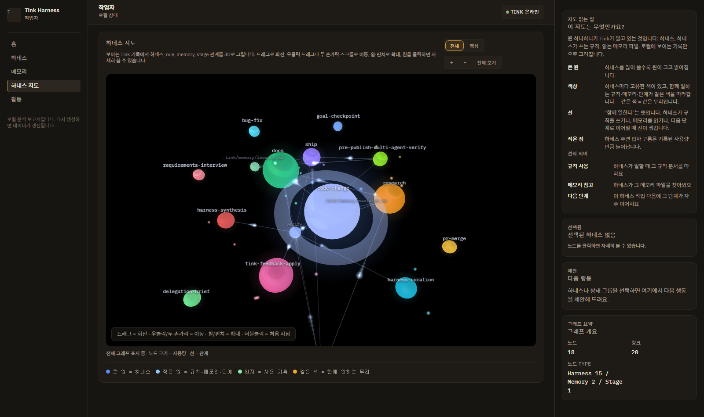

<p align="center">
  
</p>

# Tink

**Claude Code · Codex 작업의 맥락이 더는 사라지지 않게.**

Tink는 사소하지 않은 모든 에이전트 작업을 눈에 보이는 파일로 남깁니다 — 작업 계약, 실행 상태, 검증 단계, 그리고 승인해야만 저장되는 재사용 하네스. 서버도, 텔레메트리도, 숨은 상태도 없습니다.

<sub>Claude Code와 Codex를 위한 작은 하네스 레이어</sub>

**최신 패키지:** v1.10.0 — 기본 하네스가 기능 특화 세트로 바뀌었습니다. 일반 작업은 하네스 없이 기본 절차로 진행하고, update가 퇴역한 범용 하네스를 자동 정리하며 설치 때 선택(언어·범위·git 정책)을 재사용합니다. weave/frog에는 건강 요약 기반 정리와 임시초안 승격이 추가됐습니다. 전체 변경 이력은 [CHANGELOG](CHANGELOG.md)를 확인하세요.

[English](README.md) · **한국어** · [변경 이력](CHANGELOG.md)

---

## 누구를 위한 도구인가

이런 순간에 쓰세요:

- Claude Code나 Codex가 작업 사이에 맥락을 자꾸 잃을 때
- 같은 리뷰 / 리팩터링 / 디버깅 절차를 매번 손으로 반복할 때
- 숨은 채팅 기억 대신 눈에 보이는 실행 상태를 원할 때
- 재사용 가능한 에이전트 워크플로를 원하지만, 명시적 승인 후에만 저장되길 원할 때

내 얘기 같다면, 버려도 되는 repo에서 먼저 시도해 보세요:

```bash
npx tink-harness@latest install
```

## 실제로 남는 것

사소하지 않은 작업마다 열어보고, diff하고, 커밋할 수 있는 평범한 파일이 남습니다:

```text
.tink/current/                      # 진행 중인 실행 — 언제든 열람 가능
  contract.json                     #   작업이 끝났을 때 참이어야 하는 것
  plan.md                           #   눈에 보이는 계획
  checks.md                         #   "완료" 선언 전 돌릴 검증
.tink/runs/
  2026-06-11-1430-auth-refactor.md  # 끝난 실행의 간결한 기록
.tink/harnesses/
  refactor-review.md                # 재사용 작업 방식 — 승인해야 저장
```

## CLAUDE.md·슬래시 명령·스킬만으로는 왜 부족할까?

| 도구 | 제공하는 것 | Tink가 얹는 것 |
|---|---|---|
| CLAUDE.md | 프로젝트 전역 지침 | 작업 단위 계약·실행 상태·검증 |
| 슬래시 명령 | 재사용 프롬프트 | 하네스 선택, 실행 기록, 진행도 추적 |
| 스킬 | 재사용 능력 | 사용 생애주기: 건강 점수·정리·개선 신호 |
| MCP | 외부 컨텍스트·도구 | 로컬, 승인 게이트 워크플로 메모리 |

Tink는 이들을 대체하지 않고 함께 동작합니다.

---

## 빠른 시작

1분이면 Tink를 직접 써볼 수 있습니다.

**Claude Code (플러그인):**

```text
/plugin marketplace add dotoricode/tink-harness
/plugin install tink@tink-harness
/reload-plugins
/tink:setup
```

**Claude Code 또는 Codex (스탠드얼론):**

```bash
npx tink-harness@latest install
```

설치 중 `Claude Code`, `Codex`, 또는 둘 다를 선택할 수 있고, 언어는 `LANG`을 자동 감지합니다(`--lang=en|ko|zh`로 변경). Codex에서는 `$tink:cast <task>`로 시작합니다.

<details>
<summary>repo 내부 Codex smoke 검증 (CODEX_HOME)</summary>

```bash
set CODEX_HOME=%CD%\.codex
npx tink-harness@latest install
```

</details>

문서를 더 읽는 대신 실제 작업을 맡겨 보세요:

```text
/tink:cast 인증 모듈 리팩터링     # Claude Code
$tink:cast 인증 모듈 리팩터링     # Codex
```

`cast`는 작업에 맞는 하네스를 고르고(없으면 초안을 만들고), `.tink/current/`에 보이는 계획을 쓰고, 승인 후 첫 안전한 단계를 시작합니다. 끝난 run마다 간결한 기록이 남고 — 그 기록이 아래 대시보드가 됩니다.

## 하네스 건강을 눈으로 확인

몇 번의 run이 쌓이면, 명령 하나로 기록을 로컬 대시보드로 만들어 브라우저까지 열어 줍니다:

```bash
npx tink-harness dashboard          # 파일만 만들려면 --no-open 추가
```

내부적으로는 읽기 전용 helper 두 개(`node .tink/tools/generate-harness-lifecycle-summary.mjs` → `node .tink/tools/render-harness-health-report.mjs`)를 실행한 뒤 `.tink/maintenance/harness-health-report.html`을 엽니다.


<sub>당신의 워크플로와 맞는다면, ⭐ 하나가 다른 개발자들이 찾는 데 도움이 됩니다.</sub>

하네스와 그들이 쓰는 규칙·메모리, 그 연결을 보여주는 인터랙티브 3D 지도 — 무리마다 고유한 색을 갖고, 살아있는 관계 위로 신호가 흐릅니다:



실제 사용량 순으로 정렬된 하네스 카드 — 쉬운 말 건강 요약, 주의 점수, 승인 이력, 그리고 Claude Code·Codex 양쪽 복사용 명령이 포함된 다음 행동 제안:


서버도, 텔레메트리도, 숨은 캐시도 없습니다 — 제안만 준비하는 정적 로컬 페이지입니다. 재사용되는 변경은 여전히 Tink의 승인 절차를 거칩니다.

---

## 왜 만들었나

새로운 AI 코딩 하네스와 워크플로는 계속 늘어납니다. 좋은 것도 많지만, 여러 개를 섞다 보면 환경이 무거워지고 매번 다시 정리해야 합니다.

Tink는 큰 프레임워크가 아닙니다. Claude Code나 Codex가 지금 작업에 필요한 절차만 고르고, 없으면 작은 임시 하네스를 만들고, 반복되는 실수만 승인 후 재사용 지식으로 남기도록 돕습니다.

## 업데이트

Claude Code 플러그인:

```text
/plugin marketplace update tink-harness
/plugin update tink@tink-harness
/reload-plugins
```

Standalone / Codex:

```bash
npx tink-harness@latest update
```

업데이트는 질문 하나 — 어떤 agent surface를 갱신할지 — 만 묻고 나머지는 자동으로 처리합니다. 언어·설치 범위·git 정책은 설치 때 선택한 값을 그대로 재사용하며, ".tink 커밋 안 함"을 선택했다면 업데이트가 `.gitignore`를 절대 건드리지 않습니다. Tink가 관리하는 파일(commands, skills, 런타임 tools)은 항상 최신으로 덮어쓰고, 사용자가 수정한 하네스·메모리·설정과 `.tink/maintenance/`의 모든 기록(ledger 등)은 보존합니다.

`CODEX_HOME`을 지정하지 않으면 Windows에서는 `%USERPROFILE%\.codex`, macOS/Linux에서는 `~/.codex`에 Codex skill이 설치됩니다.

### 고급 옵션

Interactive install/update 중에는 **고급 옵션** 단계가 나옵니다. 예전에는 CLI flag를 직접 알아야 했지만, 이제는 선택 화면에서 볼 수 있습니다.

- `Preview only (--dry-run)`: 실제 파일을 바꾸기 전에 Tink가 무엇을 쓰고, 보존하고, 지울 예정인지 먼저 보고 싶을 때 씁니다. 파일은 변경하지 않습니다.
- `Overwrite user-modified files (--force)`: 설치가 꼬였고 공식 템플릿으로 되돌리고 싶을 때만 씁니다. 일반 업데이트는 사용자가 고친 파일을 보존합니다.
- `Clean Codex picker (--clean-codex-picker)`: 이 repo에서 Codex만 쓸 때, Codex picker에 `Source Command Tink ...` 중복 항목이 보여서 헷갈리면 씁니다. Claude Code와 Codex를 둘 다 쓰는 설치에서는 이 옵션을 보여주지 않습니다.

패키지는 이미 `tink-harness` 실행 파일 이름을 제공합니다. package manager가 이 실행 파일을 `PATH`에 설치한 환경에서는 `tink-harness update`처럼 입력할 수 있습니다. 아직 설치되어 있지 않다면 `npx tink-harness@latest update`를 계속 쓰면 됩니다. macOS와 Windows에서 직접 명령 경로를 확실히 검증한 뒤 README 예시를 더 짧게 바꾸는 작업은 계획 문서에 따로 남겨둡니다.

업데이트가 정상인지 빠르게 확인하려면 `docs/update-verification-recipe.ko.md` 또는 `docs/update-verification-recipe.md`를 확인하세요.

업데이트 후 Codex skill, schema, Windows 경고가 이상해 보이면 `docs/update-troubleshooting.ko.md` 또는 `docs/update-troubleshooting.md`를 확인하세요.

## 명령

Claude Code에서는 `/tink:*`, Codex에서는 `$tink:*`을 씁니다. 예전 `$tink cast` 형식도 호환되지만, 기본 안내와 자동완성 표면은 `$tink:*`입니다.

### `/tink:cast` / `$tink:cast`

작업을 읽고, 필요한 하네스만 고르고, `.tink/current/` 실행 상태를 만든 뒤 첫 번째 안전한 단계를 시작합니다.

Tink는 이제 비단순 작업에 대해 `.tink/current/contract.json`도 만듭니다. 이 파일에는 작업 종류, 위험, 성공 조건, 금지 사항, 검증 명령이 들어갑니다.

더 크거나 모호한 작업에서는 `cast`가 에이전트의 생각 단계를 파일로 더 잘 드러내는 하네스를 고를 수 있습니다. 모호한 아이디어는 `requirements-interview`, 큰 계획은 `plan-consensus`, 긴 실행은 `goal-checkpoint`, 안전한 인수인계는 `delegation-brief`를 씁니다. 모두 `/tink:cast` 또는 `$tink:cast`가 고르는 재사용 하네스이며, 별도 CLI 명령은 아닙니다.

### `/tink:verify` / `$tink:verify`

`contract.json`에 적힌 검증을 실제로 실행하고 증거를 남깁니다.

릴리스, 배포, 공개 PR처럼 "된 것 같다"가 아니라 "확인했다"가 필요한 작업에서 씁니다.

### `/tink:frog` / `$tink:frog`

거의 쓰지 않거나 겹치거나 너무 무거운 하네스를 정리 후보로 제안합니다. 사용자 승인 없이는 삭제하지 않습니다.

### `/tink:weave` / `$tink:weave`

실제 실패, 반복 사용, 사용자 수정 내용을 바탕으로 하네스를 조금 더 정확하게 고칩니다. 필요한 경우 `.tink/rules/`의 rule graph나 opt-in hook guard 후보로 승격합니다.

### 기타

- `/tink:setup` / `$tink:setup`: 언어, 설치 범위, git 추적, hook 정책 설정
- `/tink:list` / `$tink:list`: 사용 가능한 하네스와 사용 신호 확인
- `/tink:update` / `$tink:update`: 설치 출처를 확인하고 안전한 업데이트 안내

## 작동 방식

Tink가 아는 모든 것은 직접 읽고, diff 보고, 지울 수 있는 평범한 파일입니다.

| 경로 | 내용 |
| --- | --- |
| `.tink/harnesses/` | 하네스 세트 — 기능 특화 절차만 |
| `.tink/current/` | 현재 실행: 계획, 단계, 계약, 검증 체크 |
| `.tink/runs/` | 끝난 실행의 간결한 기록 |
| `.tink/memory/` | 승인된 교훈·선호. 초안은 `memory/candidate/`에서 대기 |
| `.tink/rules/` + `.tink/schemas/` | 하네스 선택용 작은 rule graph와 파일 스키마 |
| `.tink/maintenance/` + `.tink/tools/` | 사용 신호와 로컬 대시보드를 만드는 읽기 전용 helper |

이 전부를 움직이는 원칙은 세 가지입니다.

1. **일반 작업에는 하네스가 필요 없습니다.** 평범한 코드 변경·리뷰·문서 작업은 기본 절차(계획 → 단계 → 검증 증거)만으로 진행합니다. 하네스는 특화된 절차가 실제로 결과를 바꿀 때만 로드됩니다 — 출시 안전판, 목표 체크포인트, 계획 비평, 요구사항 인터뷰, 도메인 워크플로.
2. **제안만 합니다.** 대시보드·`frog`·`weave`는 실제 사용 신호로 제안을 준비할 뿐입니다. 재사용되는 것(하네스, 메모리, 삭제)은 반드시 별도 명시 승인을 거칩니다. 오늘 실행의 승인이 미래 실행이 물려받을 변경을 허가하지 않습니다.
3. **느낌이 아니라 증거.** 실행 기록, 실패한 체크, friction 이벤트가 무엇을 개선하고(`weave`), 초안에서 하네스로 승격하고, 정리할지(`frog`)를 결정합니다. 증거가 약하면 삭제가 아니라 유지·관찰이 기본입니다.

대시보드는 이 파일들로 만든 정적 로컬 페이지입니다 — 서버, 파일 감시, hidden cache, public `tink index` 명령이 없습니다.

<details>
<summary><strong>설계 문서 색인</strong> — 기여자용 세부 내용</summary>

- 호환성 기준 (Claude Code + Codex, macOS + Windows): `docs/compatibility-policy.md`
- Repo Signal: `docs/repo-signals.ko.md`, `docs/repo-signals.md` · graph 규칙 적용 계획: `docs/graph-rule-adoption-plan.ko.md`
- 하네스 건강 요약: `docs/harness-lifecycle-signals.ko.md`, `docs/harness-lifecycle-signals.md`
- 외부 context 안전: `docs/mcp-safe-profile.md`, `docs/external-context-policy.md`
- `.tink/current/` 상태 읽기: `docs/work-state.ko.md`, `docs/work-state.md`
- 업데이트 안정화: `docs/phase-5-update-confidence.ko.md`, `docs/phase-5-update-confidence.md`
- Context 효율: `docs/context-budget-ledger.ko.md`, `docs/context-budget-ledger.md`, `docs/context-metrics-evaluator.ko.md`, `docs/context-metrics-evaluator.md`, `docs/context-run-history-rollup.ko.md`, `docs/context-run-history-rollup.md`, `docs/context-threshold-status.ko.md`, `docs/context-threshold-status.md`, `docs/context-run-record-policy.ko.md`, `docs/context-run-record-policy.md`
- 남은 작업 단위: `docs/planned-work-units.ko.md`, `docs/planned-work-units.md` · 로드맵·아이디어 점검: `docs/tink-idea-implementation-plan.ko.md`

</details>

## 계획된 작업 단위

남은 계획은 번호가 붙은 단계보다 작업 단위 이름으로 관리합니다. 전체 목록은 `docs/planned-work-units.ko.md` 또는 `docs/planned-work-units.md`에 있으며, 세부 문서는 검증 증거 세분화, 외부 컨텍스트 정책, 메모리 결정 계층, 컨텍스트 변화 리뷰, 업데이트 진단으로 나누어 둡니다. 하네스 생애주기 신호는 이제 기본 JSON 요약과 정적 HTML 리포트까지 구현되어 별도 문서에서 관리합니다.

## Tink가 아닌 것

Tink는 코딩 에이전트, 워크플로 엔진, 멀티 에이전트 런타임, 프롬프트 라이브러리가 아닙니다. Claude Code와 Codex 위에 얹는 작은 하네스 레이어입니다.

## 기여

이슈와 PR을 환영합니다. [CONTRIBUTING.md](CONTRIBUTING.md)를 참고하세요 — 핵심은 `npm test` 실행, 명령 템플릿 3벌 동기화, [문제/해결/검증] 구조의 설명입니다.

Tink가 시간을 아껴줬다면 ⭐ 하나가 다른 개발자들이 Tink를 찾는 데 큰 도움이 됩니다.

## 라이선스

MIT
