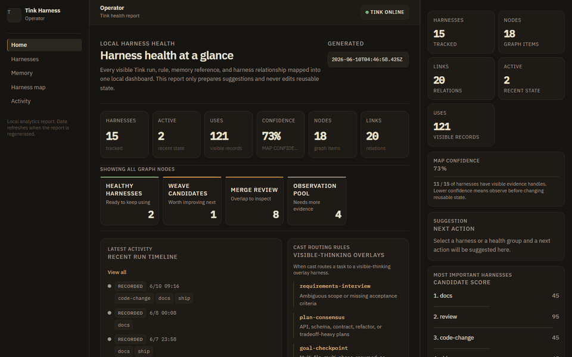
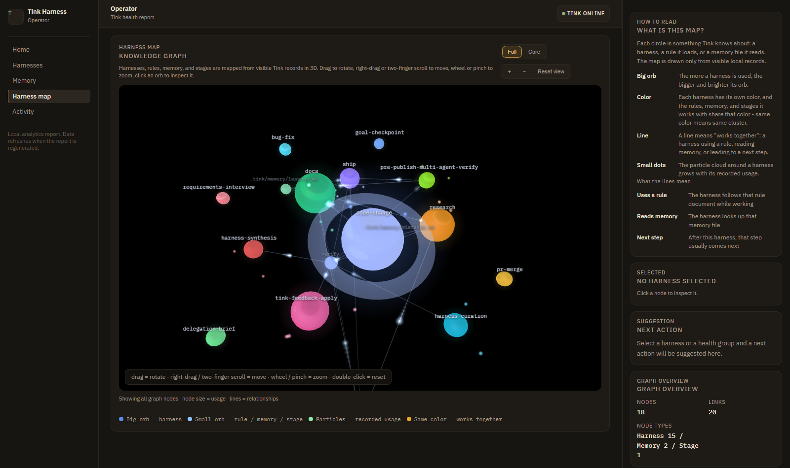
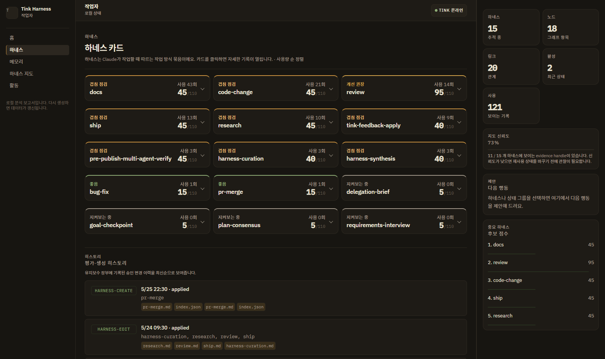

<p align="center">
  
</p>

<h1>
  <strong>Tink</strong>
</h1>

<p><strong>Stop losing context between Claude Code and Codex runs.</strong></p>

<p>
  Tink keeps every non-trivial agent task in visible files - a task contract, run state,
  verification steps, and reusable harnesses that are saved only after your approval.
  No server, no telemetry, no hidden state.
</p>

<p><sub>A small harness layer for Claude Code and Codex</sub></p>

<p>
  <a href="https://github.com/dotoricode/tink-harness/releases/tag/v1.9.22"></a>
  <a href="https://www.npmjs.com/package/tink-harness"></a>
  <a href="https://github.com/dotoricode/tink-harness/actions/workflows/ci.yml"></a>
  <a href="https://github.com/dotoricode/tink-harness/blob/main/LICENSE"></a>
  <a href="https://github.com/dotoricode/tink-harness/stargazers"></a>
</p>

<p><strong>Latest package:</strong> v1.9.22 - The local health report is now a tabbed dashboard with a 3D harness map, plain-language health summaries, and next-action suggestions with copy-paste commands for both Claude Code and Codex. See <a href="CHANGELOG.md">CHANGELOG</a> for release history.</p>

**English** · [한국어](README.ko.md) · [Changelog](CHANGELOG.md)

---

## Who this is for

Use Tink when:

- Claude Code or Codex keeps losing task context between runs
- you repeat the same review / refactor / debug workflow by hand
- you want visible run state instead of hidden chat memory
- you want reusable agent workflows - saved only after explicit approval

If that sounds like your day, try it on a throwaway repo first:

```bash
npx tink-harness@latest install
```

## What you actually get

Every non-trivial task leaves plain files you can open, diff, and commit:

```text
.tink/current/                      # the active run - always inspectable
  contract.json                     #   what must be true when the task is done
  plan.md                           #   the visible plan
  checks.md                         #   verification to run before claiming "done"
.tink/runs/
  2026-06-11-1430-auth-refactor.md  # compact record of each finished run
.tink/harnesses/
  refactor-review.md                # reusable ways of working - approval-gated
```

## Why not just CLAUDE.md / slash commands / skills?

| Tooling | What it gives you | What Tink adds on top |
|---|---|---|
| CLAUDE.md | project-wide instructions | per-task contracts, run state, and verification |
| Slash commands | reusable prompts | harness selection, run records, progress tracking |
| Skills | reusable capability | usage lifecycle: health scores, cleanup and improvement signals |
| MCP | external context and tools | local, approval-gated workflow memory |

Tink composes with all of these - it does not replace them.

---

## Install & quick start

Try Tink in about a minute.

**Claude Code (plugin):**

```text
/plugin marketplace add dotoricode/tink-harness
/plugin install tink@tink-harness
/reload-plugins
/tink:setup
```

**Claude Code or Codex (standalone):**

```bash
npx tink-harness@latest install
```

The standalone installer auto-detects `LANG` (English fallback); pass `--lang=en|ko|zh` to override. During install you can pick `Claude Code`, `Codex`, or both - in Codex, start with `$tink:cast <task>`.

<details>
<summary>Repo-local Codex smoke test (CODEX_HOME)</summary>

```bash
set CODEX_HOME=%CD%/.codex
npx tink-harness@latest install --yes
```

</details>

Then hand Tink a real task instead of reading more docs:

```text
/tink:cast refactor the auth module     # Claude Code
$tink:cast refactor the auth module     # Codex
```

`cast` picks (or drafts) the right harness, writes a visible plan into `.tink/current/`, and starts the first safe step after your approval. Every finished run leaves a compact record - and those records become the dashboard below.

## See your harness health

After a few runs, two read-only helpers turn your records into a local dashboard:

```bash
node .tink/tools/generate-harness-lifecycle-summary.mjs
node .tink/tools/render-harness-health-report.mjs
# then open .tink/maintenance/harness-health-report.html
```



<sub>If this matches your workflow, a ⭐ helps others find it.</sub>

An interactive 3D map of your harnesses, the rules and memory they use, and how they connect - each cluster gets its own color, and neural pulses travel along live relationships:



Harness cards sorted by real usage, with plain-language health summaries, an attention score, the approval history, and a suggested next action with copy-paste commands for both Claude Code and Codex:



No server, no telemetry, no hidden cache - it is a static local page that only prepares suggestions. Anything reusable still goes through Tink's approval gates.

---

## Why I made this

*Tink is <strong>knit</strong> in reverse: untying tangled workflows and knitting better ones back together. It also nods to Tinker Bell, the small helper at your side.*

New coding harnesses show up almost every day. Many of them are genuinely useful.

At first, I tried them one by one and kept the ones that fit me. But the more I mixed them, the more my environment got tangled. Resetting everything again and again was tiring, so I ended up falling back to a skill-based workflow that I could understand and control.

Then I used Hermes Agent for a while. What stayed with me was the way it gets better through use: repeated work turns into reusable skills, mistakes become memory, and the system slowly adapts to the person using it.

Tink started from a simple question:

> Could Claude Code or Codex grow with me in the same way?

Not by adding a big framework. Not by running more agents. Just by helping Claude or Codex choose the right harness for the current task, create one when nothing fits, and improve the set over time.

## Update

Claude Code plugin users:

```text
/plugin marketplace update tink-harness
```

```text
/plugin update tink@tink-harness
```

```text
/reload-plugins
```

If update does not find the latest version, uninstall and install again:

```text
/plugin uninstall tink@tink-harness
```

```text
/plugin install tink@tink-harness
```

To update an existing standalone install (Claude Code or Codex):

```bash
npx tink-harness@latest update
```

Update asks one question - which agent surface to refresh - and handles the rest automatically. Tink-owned files (commands, skills, maintenance, runtime tools) are always brought to the latest version; your customized harnesses, memory, and config are preserved.

If `CODEX_HOME` is not set, Codex skills default to `%USERPROFILE%\.codex` on Windows and `~/.codex` on macOS/Linux.

### Advanced options

Interactive install/update includes an **Advanced options** step. These options used to require CLI flags, but now they are visible in the wizard:

- `Preview only (--dry-run)`: use this first when you want to see the exact files Tink would write, preserve, or remove. It does not change files.
- `Overwrite user-modified files (--force)`: use this only when an install is broken and you want official templates to replace local edits. Normal updates keep user-modified files.
- `Clean Codex picker (--clean-codex-picker)`: use this when you are switching a repo to Codex-only Tink and Codex shows duplicate `Source Command Tink ...` entries. It is not shown for mixed Claude Code + Codex installs.

The package already exposes a `tink-harness` binary. If your package manager has installed that binary on your `PATH`, you can run `tink-harness update`. If not, keep using `npx tink-harness@latest update`. A shorter direct-command path is tracked in the planned work docs so it can be verified across macOS and Windows before the README examples switch over.

To quickly verify the updated install, see `docs/update-verification-recipe.md` or `docs/update-verification-recipe.ko.md`.

If an update looks stale or incomplete, see `docs/update-troubleshooting.md` or `docs/update-troubleshooting.ko.md`.

## Commands

Tink keeps the command surface small.

Tink is plugin-first in Claude Code. Commands are namespaced under `tink`, so the public surface stays `/tink:*` and avoids generic command conflicts. In Codex, Tink installs matching `$tink:*` skills for autocomplete: `$tink:cast`, `$tink:verify`, `$tink:list`, `$tink:frog`, `$tink:weave`, `$tink:setup`, and `$tink:update`. Legacy `$tink cast` style prompts still work, but `$tink:*` is the preferred spelling.

### `/tink:cast` / `$tink:cast`

**cast** means to place the first loops on the needle (코잡기, Cast on). In knitting, casting on is the very first step — it sets the foundation for everything that follows.

In Tink, `cast` is the main path. It reads the task, chooses or drafts the right harness, runs a quick internal sanity check, creates `.tink/current/` as the visible workbench, and starts the first safe step after approval.

Use it when the task is more than a quick answer.

For bigger or fuzzier work, `cast` can expose more of the agent's thinking as files without adding new commands. Ambiguous ideas can start with `requirements-interview`, broad plans with `plan-consensus`, long runs with `goal-checkpoint`, and safe handoffs with `delegation-brief`. These are reusable harnesses selected by `/tink:cast` or `$tink:cast`, not separate CLI workflows.

### `/tink:verify` / `$tink:verify`

`verify` runs the checks promised in `.tink/current/contract.json`.

Tink now writes a small task contract for non-trivial runs: what kind of work this is, what must be true when it is done, what is forbidden, and which commands or manual checks prove it. `/tink:verify` uses that contract instead of relying on a vague "looks done" claim.

Use it before release, publish, deploy, public PR, or any task where evidence matters.

### `/tink:frog` / `$tink:frog`

**frog** means to rip out stitches (풀시오, Frogging). In knitting, frogging unravels rows that went wrong — the name comes from the sound of pulling out yarn, "rip it, rip it."

In Tink, `frog` looks for harnesses that are unused, overlapping, too broad, or no longer worth their context cost. It proposes cleanup, but does not delete without approval.

Use it when the harness set starts to feel noisy.

### `/tink:weave` / `$tink:weave`

**weave** means to weave in the ends (실오라기 정리, Weave in). In knitting, weaving in secures the loose threads left after finishing, giving the work its final shape.

In Tink, `weave` improves an existing harness using real use, failures, and corrections. It should make the next run clearer, safer, or easier to verify.

Use it when a harness is useful but slightly wrong.

### Other commands

- `/tink:setup` / `$tink:setup`: choose language, install scope, git tracking, and hook policy.
- `/tink:list` / `$tink:list`: inspect available harnesses and recent usage signals.
- `/tink:update` / `$tink:update`: detect install source and show the safe update command.

## How it works

Tink uses files you can inspect:

- `.tink/harnesses/`: reusable task harnesses
- `.tink/rules/`: a small rule graph that chooses only relevant harnesses, checks, and opt-in guard candidates
- `.tink/schemas/`: structured file schemas, including the current run contract
- `.tink/current/`: the current run state
- `.tink/runs/`: compact records from finished, blocked, canceled, or replaced runs
- `.tink/maintenance/`: verification, friction, and weave signals that help repeated failures become approved improvements
- `.tink/memory/`: approved mistakes, preferences, and lessons

Tink can also read those records into a harness health summary. The summary shows which harnesses were used, where checks failed or got blocked, which harnesses often appear together, and which ones may deserve a weave improvement, frog cleanup review, merge review, dormant archive review, or more observation. It also includes an explainable candidate score, lifecycle state, graph relationships, and recent run timeline. It only prepares suggestions. Tink does not edit, merge, archive, delete, save memory, or update rules without the same explicit approval gates as the rest of Tink.

Two read-only helpers turn those records into the local dashboard shown in [Install & quick start](#install--quick-start). The report is a static local page - no server, no file watching, no hidden cache, no public `tink index` command. It only prepares suggestions; reusable-state changes keep their approval gates.

When selected, current-run artifacts may also include `.tink/current/goals.json` for goal checkpoints or `.tink/current/delegation.md` for handoff packets. Tink prepares those briefs as visible state; it does not start workers, tmux panes, or worktrees unless a separate approved workflow does so.

The rule graph stays small on purpose. Tink loads matching mandatory rules first, retrieves only relevant optional rules by task facts or keywords, and records loaded rule ids by phase so the same guidance is not repeated in one run.

Design notes live in `docs/`. The compatibility baseline is `docs/compatibility-policy.md`: every new slice should consider Claude Code and Codex, plus macOS and Windows. Repo signal behavior is described in `docs/repo-signals.md` or `docs/repo-signals.ko.md`. The lightweight graph-rule adoption plan is `docs/graph-rule-adoption-plan.ko.md`. Harness health summaries are described in `docs/harness-lifecycle-signals.md` or `docs/harness-lifecycle-signals.ko.md`. External context safety is described in `docs/mcp-safe-profile.md` and `docs/external-context-policy.md`. To read or review `.tink/current/` state, start with `docs/work-state.md` or `docs/work-state.ko.md`. Update confidence is still documented in `docs/phase-5-update-confidence.md` or `docs/phase-5-update-confidence.ko.md`. Context efficiency docs live in `docs/context-budget-ledger.md`, `docs/context-budget-ledger.ko.md`, `docs/context-metrics-evaluator.md`, `docs/context-metrics-evaluator.ko.md`, `docs/context-run-history-rollup.md`, `docs/context-run-history-rollup.ko.md`, `docs/context-threshold-status.md`, `docs/context-threshold-status.ko.md`, `docs/context-run-record-policy.md`, and `docs/context-run-record-policy.ko.md`. The planned work-unit list is `docs/planned-work-units.md` or `docs/planned-work-units.ko.md`, with details in the verification evidence, memory decision, context change, and update diagnosis docs. The broader Korean idea audit and roadmap is `docs/tink-idea-implementation-plan.ko.md`.

The important rule is approval.

Tink may suggest a harness, a memory entry, a cleanup, or an improvement. Before each run is committed, Tink runs one quick sanity check and surfaces a proposal only when something important is at stake. Low-risk steps let you continue with recorded assumptions; irreversible or externally visible actions (publish, deploy, deletions, broad changes) require explicit approval. Saving anything reusable — a new harness, a memory entry, a `.claude/` workflow file — always needs its own separate approval; approving the current run does not authorize saves that future installs would inherit.

## What Tink is not

Tink is not:

- a coding agent
- a workflow engine
- a multi-agent runtime
- a prompt library
- a replacement for Claude Code or Codex

It is a small harness layer for Claude Code or Codex.

## Contributing

Issues and pull requests are welcome. Start with [CONTRIBUTING.md](CONTRIBUTING.md) - the short version: run `npm test`, keep command templates in sync across their three copies, and describe changes as problem / solution / verification.

If Tink saves you time, a ⭐ helps other developers find it.

## License

MIT
